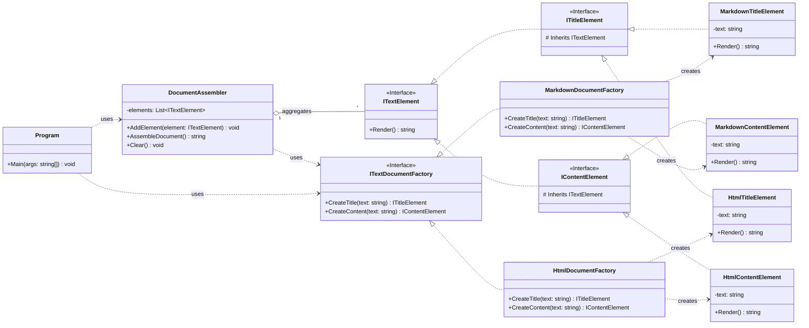

## 单例模式

### 实现方法（C#）

#### 饿汉式

```csharp
public class Singleton
{
    private static readonly Singleton _instance = new Singleton();

    // 私有构造函数，防止外部实例化
    private Singleton() {}

    public static Singleton Instance => _instance;
}
```

#### 懒汉式

```csharp
public class Singleton
{
    private static Singleton _instance;

    private Singleton() {}

    public static Singleton Instance
    {
        get
        {
            if (_instance == null)
            {
                _instance = new Singleton();
            }
            return _instance;
        }
    }
}

// 双重锁定
public class Singleton
{
    private static Singleton _instance;
    private static readonly object _lock = new object();

    private Singleton() {}

    public static Singleton Instance
    {
        get
        {
            if (_instance == null)
            {
                lock (_lock)
                {
                    if (_instance == null)
                    {
                        _instance = new Singleton();
                    }
                }
            }
            return _instance;
        }
    }
}

```

#### Lazy<T>

```csharp
public class Singleton
{
    private static readonly Lazy<Singleton> _instance = new Lazy<Singleton>(() => new Singleton());

    private Singleton() {}

    public static Singleton Instance => _instance.Value;
}

```

#### 静态构造

```csharp
public class Singleton
{
    private static readonly Singleton _instance;

    static Singleton()
    {
        _instance = new Singleton();
    }

    private Singleton() {}

    public static Singleton Instance => _instance;
}

```

#### CAS原子操作

```csharp
public class Singleton
{
    private static volatile Singleton _instance;

    private Singleton() {}

    public static Singleton Instance
    {
        get
        {
            // 第一次检查：如果实例已创建，直接返回
            if (_instance != null) return _instance;

            // 使用 CAS 来原子性地创建单例实例
            Interlocked.CompareExchange(ref _instance, new Singleton(), null);

            return _instance;  // 返回实例（可能已经是其他线程创建的）
        }
    }
}

// CompareExchange等效于以下代码，由于这个它是原子操作，就不需要加锁
// if (_instance == null) 
// 		lock(_instance)
//		{
//			_instance = new Singleton();
// 		}

```

### 其他

#### 关于线程安全

​	饿汉式、双重锁定懒汉式、Lazy、静态构造、CAS都是线程安全的

## 适配器方法

​	其思想是通过**统一的接口**写适配器，来适配不同的系统
​	如触屏输入的XY与鼠标输入的XY，两者方法不同的情况下，可以通过实现相同的接口获取到不同系统的方法
​	又或者，有一个zip的压缩器和一个rar的压缩器，想用一个统一的压缩、解压方法来使用，可以写两个适配器，都有压缩、解压方法

​	组合实现类似包装，继承实现类似扩展，
​	并且，适配器在对具体类进行适配时，可以不用继承接口（如下面的Zip和Rar）

### 组合实现

```csharp
// Adaptee：需要适配的类
public class Zip
{
    public void ZipComp()
    {
        Debug.Log("Zip Compress");
    }
    
    public void ZipDecomp()
    {
        Debug.Log("Zip Decompress");
    }
}

public class Rar
{
    public void RarComp()
    {
        Debug.Log("Rar Compress");
    }
    
    public void RarDecomp()
    {
        Debug.Log("Rar Decompress");
    }
}

// ICompressor：目标接口
public interface ICompressor
{
    public void Compress();
    public void Decompress();
}

// 适配器类，包含关系进行引用
public class ZipAdapter : ICompressor
{
    private readonly Zip _zip;

    public ZipAdapter(Zip zip)
    {
        _zip = zip;
    }

    public void Comp()
    {
        Debug.Log("Zip Compress");
    }
    
    public void Decomp()
    {
        Debug.Log("Zip Decompress");
    }
}

public class RarAdapter : ICompressor
{
    private readonly Rar _rar;

    public ZipAdapter(Rar rar)
    {
        _rar = rar;
    }

    public void Comp()
    {
        Debug.Log("Rar Compress");
    }
    
    public void Decomp()
    {
        Debug.Log("Rar Decompress");
    }
}


// Client：客户端
public class Client
{
    public void Run(bool useZip)
    {
        var zip = new Zip();
        var rar = new Rar();
        
        var zipAdapter = new ZipAdapter(zip);
        var rarAdapter = new RarAdapter(rar);
        
        ICompressor compressor = useZip? zipAdapter : rarAdapter;
        compressor.Comp();
        compressor.Decomp();
    }
}

```

### 继承实现

```csharp
// Adaptee：需要适配的类
public class Zip
{
    public void ZipComp()
    {
        Debug.Log("Zip Compress");
    }
    
    public void ZipDecomp()
    {
        Debug.Log("Zip Decompress");
    }
}

public class Rar
{
    public void RarComp()
    {
        Debug.Log("Rar Compress");
    }
    
    public void RarDecomp()
    {
        Debug.Log("Rar Decompress");
    }
}

// ICompressor：目标接口
public interface ICompressor
{
    public void Compress();
    public void Decompress();
}

// 适配器类，继承实现，类似于在原类中额外加了两个通用方法
public class ZipAdapter : Zip, ICompressor
{
    public void Comp()
    {
        ZipComp();
    }
    
    public void Decomp()
    {
        ZipDecomp();
    }
}

public class RarAdapter : Rar, ICompressor
{
    public void Comp()
    {
        RarComp();
    }
    
    public void Decomp()
    {
        RarDecomp();
    }
}


// Client：客户端
public class Client
{
    public void Run(bool useZip)
    {
		var zipAdapter = new ZipAdapter();
        var rarAdapter = new RarAdapter();
        
        ICompressor compressor = useZip? zipAdapter : rarAdapter;
        compressor.Comp();
        compressor.Decomp();
    }
}

```

### 双向适配器

​	这个简单来说，就是需要zip和rar相互支持，我本以为上述代码某种程度上实现了这一功能，但实际上，上述代码是将两种接口通过单向适配器适配到了通用接口上。
​	双向适配器则是用来zip向rar接口转换，以及rar接口向zip接口转换，调用zip方法实际上调用的rar方法，
​	对于不能多重继承的语言，双向适配器由组合实现。

```csharp
// Zip 类
public class Zip
{
    public void ZipCompress()
    {
        Console.WriteLine("Zip: Compress");
    }

    public void ZipDecompress()
    {
        Console.WriteLine("Zip: Decompress");
    }
}

// Rar 类
public class Rar
{
    public void RarCompress()
    {
        Console.WriteLine("Rar: Compress");
    }

    public void RarDecompress()
    {
        Console.WriteLine("Rar: Decompress");
    }
}

// 双向适配器
public class BidirectionalAdapter
{
    private Zip _zip;
    private Rar _rar;

    // 构造方法，用于适配 Zip
    public BidirectionalAdapter(Zip zip)
    {
        _zip = zip;
    }

    // 构造方法，用于适配 Rar
    public BidirectionalAdapter(Rar rar)
    {
        _rar = rar;
    }

    // 调用压缩方法
    public void Compress()
    {
        if (_zip != null)
        {
            _zip.ZipCompress();
        }
        else if (_rar != null)
        {
            Console.WriteLine("Adapting Rar to Zip");
            _rar.RarCompress();
        }
    }

    // 调用解压方法
    public void Decompress()
    {
        if (_zip != null)
        {
            _zip.ZipDecompress();
        }
        else if (_rar != null)
        {
            Console.WriteLine("Adapting Zip to Rar");
            _rar.RarDecompress();
        }
    }
}
```

## 模板方法模式

​	其实就是抽象类的实现，因此不多赘述

### 钩子方法

​	其思想在于在子类中实现的逻辑会影响父类中的逻辑
​	如一个条件判断的方法，我们在子类中重写后，就会影响父类相应的条件判断

### IoC（Inversion of Control，控制反转）

​	IoC 是一种设计原则，指将**对象的创建或依赖关系的管理交给外部容器**，而不是由对象自身控制。通过 IoC，可以降低模块之间的耦合性，提高代码的灵活性和可维护性。

### DIP（Dependency Inversion Principle，依赖倒置原则）

​	高层模块不应该依赖于低层模块，二者都应该依赖于抽象。
​	抽象不应该依赖于具体实现，具体实现应该依赖于抽象。
​	也就是现有抽象，再实现抽象

### Dependency Injection（依赖注入）

​	依赖注入是**实现 IoC 的一种方式**，通过将依赖对象注入到目标对象中，而不是目标对象自己创建依赖对象

- 常见的依赖注入方式有： 

  - 构造器注入：通过构造方法传递依赖。

  - Setter 方法注入：通过 Setter 方法传递依赖。

  - 接口注入：通过接口方法（即接口实现Setter方法）传递依赖。

## 迭代器

​	与其说一种模式，不如说是对于OOAD和模板方法的典型实践
​	其思想是提供一种方法顺序（不确定 ）访问一个聚合对象中各个元素，而又不暴露该对象的内部表示

## 工厂模式

### OCP思想（开闭原则）

​	开闭原则 (OCP) 是面向对象编程中的一个基本原则，它指出应用程序实体（类、模块、方法等）应该对扩展开放但对修改关闭。换句话说，您应该能够在不更改现有代码的情况下向应用程序添加新功能。

​	对于本模式，也就是可以在不修改现有工厂、产品类的同时，加入新的工厂、产品等

### 实现方法

#### 简单工厂

```csharp
// 需求是一个工厂需要生产不同的产品
public class Factory
{
    public IProduct Create(string type)
    {
        case "A":
        	return new ProductA();
        	break;
        case "B":
        	return new ProductB():
        	break;
        default:
        	return null;
        	break;
    }
}

public class IProduct
{
    
}

public class ProductA : IProduct
{
    
}

public class ProductB : IProduct
{
    
}
```

#### 工厂方法

```csharp
// 需求是多个工厂，一个工厂生产一种商品
public class IFactory
{
    public IProduct Create();
}

public class Factory : IFactory
{
    public IProduct Create(string type)
    {
        case "A":
        	return new ProductA();
        	break;
        case "B":
        	return new ProductB():
        	break;
        default:
        	return null;
        	break;
    }
}

public class IProduct
{
    
}

public class ProductA : IProduct
{
    
}

public class ProductB : IProduct
{
    
}
```

#### 抽象工厂

​	是为了解决存在多个不同的产品族，每个具体工厂会生产某产品族

​	添加具体工厂类是容易的，但添加具体产品是麻烦的，需要对工厂的方法进行扩展（如添加CreateProductC方法），表现为OCP的倾斜性

**对于抽象工厂和工厂模式的区别：**

​	工厂方法模式：A -> F1，F1 生产 P1；A -> F2，F2 生产 P2。每个工厂只负责生产一种类型的产品。

​	抽象工厂模式：A -> F1.1，F1.1 生产 P1.1；A -> F1.2，F1.2 生产 P1.2。每个工厂负责生产一组相关的产品

##### 单抽象的实现

```csharp
// --- 1. Abstract Products ---
// 定义文档组成部分（产品）的抽象接口

// 基础文本元素接口
public interface ITextElement
{
    string Render(); // 每个元素都知道如何将自己渲染成字符串
}

// 抽象标题元素
public interface ITitleElement : ITextElement { }

// 抽象内容元素
public interface IContentElement : ITextElement { }


// --- 2. Concrete Products ---
// 为每种格式（Markdown, HTML）实现具体的文档组成部分

// --- Markdown 产品 ---
public class MarkdownTitleElement : ITitleElement
{
    private readonly string _text;
    public MarkdownTitleElement(string text) { _text = text; }
    public string Render() => $"# {_text}\n"; // 返回 Markdown 标题格式
}

public class MarkdownContentElement : IContentElement
{
    private readonly string _text;
    public MarkdownContentElement(string text) { _text = text; }
    public string Render() => $"{_text}\n"; // 返回 Markdown 内容格式
}

// --- HTML 产品 ---
public class HtmlTitleElement : ITitleElement
{
    private readonly string _text;
    public HtmlTitleElement(string text) { _text = text; }
    public string Render() => $"<h1>{_text}</h1>\n"; // 返回 HTML H1 格式
}

public class HtmlContentElement : IContentElement
{
    private readonly string _text;
    public HtmlContentElement(string text) { _text = text; }
    public string Render() => $"<p>{_text}</p>\n"; // 返回 HTML 段落格式
}


// --- 3. Abstract Factory ---
// 定义创建一系列相关产品（文本元素）的接口
public interface ITextDocumentFactory
{
    ITitleElement CreateTitle(string text);
    IContentElement CreateContent(string text);
    // 可以添加更多方法来创建其他元素，如 CreateList, CreateLink 等
}


// --- 4. Concrete Factories ---
// 实现抽象工厂接口，为特定格式创建具体的产品实例

// --- Markdown 工厂 ---
public class MarkdownDocumentFactory : ITextDocumentFactory
{
    public ITitleElement CreateTitle(string text)
    {
        return new MarkdownTitleElement(text); // 直接返回具体产品
    }

    public IContentElement CreateContent(string text)
    {
        return new MarkdownContentElement(text); // 直接返回具体产品
    }
}

// --- HTML 工厂 ---
public class HtmlDocumentFactory : ITextDocumentFactory
{
    public ITitleElement CreateTitle(string text)
    {
        return new HtmlTitleElement(text); // 直接返回具体产品
    }

    public IContentElement CreateContent(string text)
    {
        return new HtmlContentElement(text); // 直接返回具体产品
    }
}


// --- 5. Client Code ---
public class DocumentAssembler
{
    // 客户端使用工厂创建的元素列表来组装文档
    private List<ITextElement> _elements = new List<ITextElement>();

    // 客户端调用工厂来创建零件，然后自己存储这些零件
    public void AddElement(ITextElement element)
    {
        _elements.Add(element);
    }

    // 客户端负责将所有零件组合（渲染）成最终文档
    public string AssembleDocument()
    {
        StringBuilder finalDocument = new StringBuilder();
        // --- HTML 特殊处理：添加外层标签 ---
        // 注意：这种格式特定的组装逻辑现在在客户端，
        // 或者可以引入更复杂的结构来处理。
        // 对于纯粹的抽象工厂，客户端通常需要知道如何组合。
        // 如果第一个元素是 HtmlTitleElement，我们可能想添加<html><body>等
        bool isHtml = _elements.Count > 0 && _elements[0] is HtmlTitleElement;

        if (isHtml) {
             finalDocument.AppendLine("<!DOCTYPE html>");
             finalDocument.AppendLine("<html>");
             finalDocument.AppendLine("<head><title>Generated Document</title></head>");
             finalDocument.AppendLine("<body>");
        }

        foreach (var element in _elements)
        {
            finalDocument.Append(element.Render()); // 调用每个元素的渲染方法
        }

         if (isHtml) {
             finalDocument.AppendLine("</body>");
             finalDocument.AppendLine("</html>");
        }
        return finalDocument.ToString();
    }

    public void Clear()
    {
        _elements.Clear();
    }
}

// --- 示例用法 ---
public class Program
{
    public static void Main(string[] args)
    {
        // --- 选择 Markdown 工厂 ---
        ITextDocumentFactory factory = new MarkdownDocumentFactory();
        DocumentAssembler assembler = new DocumentAssembler();

        // 客户端使用工厂创建零件，并添加到组装器
        ITitleElement mdTitle = factory.CreateTitle("My Markdown Document");
        assembler.AddElement(mdTitle);
        IContentElement mdContent = factory.CreateContent("This is Markdown content.");
        assembler.AddElement(mdContent);

        // 客户端组装并获取最终文档
        string markdownDoc = assembler.AssembleDocument();
        Console.WriteLine(markdownDoc);

        // --- 清理并切换到 HTML 工厂 ---
        assembler.Clear();
        factory = new HtmlDocumentFactory(); // 更换工厂实例

        // 使用新工厂创建零件
        ITitleElement htmlTitle = factory.CreateTitle("My HTML Document");
        assembler.AddElement(htmlTitle);
        IContentElement htmlContent = factory.CreateContent("This is <b>HTML</b> content.");
        assembler.AddElement(htmlContent);

         // 客户端使用相同的组装逻辑（但零件不同）
        string htmlDoc = assembler.AssembleDocument();
        Console.WriteLine(htmlDoc);
    }
}
```




##### 多抽象的实现	

​	这个工厂的使用其实是有些别扭的，例如我们需要对html进行额外的判断，也许我们可以把这个判断也作为产品的一部分？

```csharp
using System;
using System.Collections.Generic;
using System.Text;

// --- 1. Abstract Products ---

// 保持不变: 代表可渲染的独立元素
public interface ITextElement
{
    string Render();
}
public interface ITitleElement : ITextElement { }
public interface IContentElement : ITextElement { }

// 新增: 代表整个文档的结构/容器
public interface IDocument
{
    void AddElement(ITextElement element); // 向文档结构中添加元素
    string RenderDocument();               // 渲染整个文档，包含必要的结构标签
}

// --- 2. Concrete Products ---

// --- Markdown 产品 ---
public class MarkdownTitleElement : ITitleElement
{
    private readonly string _text;
    public MarkdownTitleElement(string text) { _text = text; }
    public string Render() => $"# {_text}\n";
}

public class MarkdownContentElement : IContentElement
{
    private readonly string _text;
    public MarkdownContentElement(string text) { _text = text; }
    public string Render() => $"{_text}\n";
}

// 新增: Markdown 文档结构产品
public class MarkdownDocument : IDocument
{
    private List<ITextElement> _elements = new List<ITextElement>();

    public void AddElement(ITextElement element)
    {
        _elements.Add(element);
    }

    // Markdown 通常不需要特殊的全局包装器
    public string RenderDocument()
    {
        StringBuilder sb = new StringBuilder();
        foreach (var element in _elements)
        {
            sb.Append(element.Render());
        }
        return sb.ToString();
    }
}


// --- HTML 产品 ---
public class HtmlTitleElement : ITitleElement
{
    private readonly string _text;
    public HtmlTitleElement(string text) { _text = text; }
    public string Render() => $"    <h1>{_text}</h1>\n"; // Indentation for readability
}

public class HtmlContentElement : IContentElement
{
    private readonly string _text;
    public HtmlContentElement(string text) { _text = text; }
    public string Render() => $"    <p>{_text}</p>\n"; // Indentation for readability
}

// 新增: HTML 文档结构产品
public class HtmlDocument : IDocument
{
    private List<ITextElement> _elements = new List<ITextElement>();
    private string _pageTitle = "Generated Document"; // Default title

    public void AddElement(ITextElement element)
    {
        _elements.Add(element);
    }

    // HTML 文档的渲染包含了必要的包装标签
    public string RenderDocument()
    {
        StringBuilder sb = new StringBuilder();
        sb.AppendLine("<!DOCTYPE html>");
        sb.AppendLine("<html>");
        sb.AppendLine("<head>");
        sb.AppendLine($"<title>{_pageTitle}</title>"); // Use the stored title
        sb.AppendLine("</head>");
        sb.AppendLine("<body>");
        foreach (var element in _elements)
        {
            sb.Append(element.Render()); // Append rendered element
        }
        sb.AppendLine("</body>");
        sb.AppendLine("</html>");
        return sb.ToString();
    }
}


// --- 3. Abstract Factory ---
// 添加创建 IDocument 的方法
public interface ITextDocumentFactory
{
    IDocument CreateDocument(); // 创建文档结构对象
    ITitleElement CreateTitle(string text);
    IContentElement CreateContent(string text);
}


// --- 4. Concrete Factories ---

// --- Markdown 工厂 ---
public class MarkdownDocumentFactory : ITextDocumentFactory
{
    public IDocument CreateDocument()
    {
        return new MarkdownDocument();
    }
    public ITitleElement CreateTitle(string text)
    {
        return new MarkdownTitleElement(text);
    }
    public IContentElement CreateContent(string text)
    {
        return new MarkdownContentElement(text);
    }
}

// --- HTML 工厂 ---
public class HtmlDocumentFactory : ITextDocumentFactory
{
     public IDocument CreateDocument()
    {
        return new HtmlDocument();
    }
    public ITitleElement CreateTitle(string text)
    {
        return new HtmlTitleElement(text);
    }
    public IContentElement CreateContent(string text)
    {
        return new HtmlContentElement(text);
    }
}


// --- 5. Client Code ---
// 客户端现在变得更通用，不再关心具体格式的包装细节
public class DocumentGeneratorClient
{
    private ITextDocumentFactory _factory;

    public DocumentGeneratorClient(ITextDocumentFactory factory)
    {
        _factory = factory;
    }

    public string Generate(string title, string content)
    {
        // 1. 创建文档结构对象 (由工厂决定是 MarkdownDocument 还是 HtmlDocument)
        IDocument document = _factory.CreateDocument();

        // 2. 创建具体的元素 (由工厂决定是 Markdown 还是 HTML 元素)
        ITitleElement titleElement = _factory.CreateTitle(title);
        IContentElement contentElement = _factory.CreateContent(content);

        // 3. 将元素添加到文档结构中
        document.AddElement(titleElement);
        document.AddElement(contentElement);

        // 4. 请求文档结构对象进行最终渲染
        return document.RenderDocument();
    }

     public void SetFactory(ITextDocumentFactory factory)
    {
        _factory = factory;
    }
}

// --- 示例用法 ---
public class Program
{
    public static void Main(string[] args)
    {
        // --- 使用 Markdown 工厂 ---
        ITextDocumentFactory factory = new MarkdownDocumentFactory();
        DocumentGeneratorClient client = new DocumentGeneratorClient(factory);

        string markdownDoc = client.Generate("My Markdown Document", "This is Markdown content.");
        Console.WriteLine(markdownDoc);

        // --- 切换到 HTML 工厂 ---
        client.SetFactory(new HtmlDocumentFactory()); // 更换工厂实例

        string htmlDoc = client.Generate("My HTML Document", "This is <b>HTML</b> content.");
        Console.WriteLine(htmlDoc);
    }
}
```

##### 借助建造者模式的实现

​	在学习了建造者模式，回过头来，可以发现其实DocumentGeneratorClient是一个Director，他们的行为也很相似，例如创建文档对象、添加元素、生成文档内容，这个步骤和建造者基本一致

​	但不同点在于工厂返回了多个同族的对象，另外，尽管IDocument和ITextElement是相互独立的，但他们也是同族的，这里的概念在于他们都是Markdown/Html格式，而非在于他们都是实现某个接口

​	下面我们尝试用接近建造者模式的工厂模式进行尝试：

```csharp
// 1. Abstract Factory (抽象工厂)
// 定义了创建文档各个部分（产品）以及获取最终结果的接口
public abstract class TextDocumentFactory
{
    // 建造者的构建步骤
    public abstract void AddTitle(string title);
    public abstract void AddContent(string content);

    // 获取最终产品（整个格式化后的文档）
    public abstract string GetResult();

    // 重置工厂状态，以便创建新文档
    public abstract void Reset();
}

// 2. Concrete Factories (具体工厂)

// --- Markdown 工厂 ---
public class MarkdownFactory : TextDocumentFactory
{
    private StringBuilder _document = new StringBuilder();

    public override void Reset()
    {
        _document.Clear();
    }

    public override void AddTitle(string title)
    {
        _document.AppendLine($"# {title}"); // Markdown H1 标题
        _document.AppendLine(); // 添加空行
    }

    public override void AddContent(string content)
    {
        _document.AppendLine(content); // Markdown 段落
        _document.AppendLine(); // 添加空行
    }

    // 返回构建好的 Markdown 字符串
    public override string GetResult()
    {
        string result = _document.ToString();
        // Reset(); // 可以在获取结果后自动重置
        return result;
    }
}

// --- HTML 工厂 ---
public class HtmlFactory : TextDocumentFactory
{
    private StringBuilder _document = new StringBuilder();
    private bool _bodyOpened = false; // 简单状态跟踪

     public override void Reset()
    {
        _document.Clear();
        _bodyOpened = false;
        _document.AppendLine("<!DOCTYPE html>");
        _document.AppendLine("<html>");
        _document.AppendLine("<head><title>Generated Document</title></head>");
    }

    private void EnsureBodyOpened()
    {
        if (!_bodyOpened)
        {
            _document.AppendLine("<body>");
            _bodyOpened = true;
        }
    }

    public override void AddTitle(string title)
    {
        EnsureBodyOpened();
        _document.AppendLine($"    <h1>{title}</h1>"); // HTML H1 标题
    }

    public override void AddContent(string content)
    {
         EnsureBodyOpened();
        _document.AppendLine($"    <p>{content}</p>"); // HTML 段落
    }

    // 返回构建好的 HTML 字符串
    public override string GetResult()
    {
        if (_bodyOpened)
        {
             _document.AppendLine("</body>");
        }
        _document.AppendLine("</html>");
        string result = _document.ToString();
       // Reset(); // 可以在获取结果后自动重置
        return result;
    }
}

// 3. Client Code (客户端代码)
public class DocumentGenerator
{
    // 客户端依赖于抽象工厂接口
    private TextDocumentFactory _factory;

    public DocumentGenerator(TextDocumentFactory factory)
    {
        this._factory = factory;
        this._factory.Reset(); // 初始化时重置工厂
    }

    // 客户端使用工厂来构建文档，不关心具体格式
    public string GenerateDocument(string title, string content)
    {
        // 注意：这里客户端调用的顺序决定了文档结构
        _factory.AddTitle(title);
        _factory.AddContent(content);
        // 可以添加更多步骤，如 AddSection, AddImage 等，只要在 Factory 接口和实现中定义
        return _factory.GetResult();
    }

     // 允许更换工厂
    public void SetFactory(TextDocumentFactory factory)
    {
        this._factory = factory;
        this._factory.Reset(); // 更换后重置
    }
}

// --- 示例用法 ---
public class Program
{
    public static void Main(string[] args)
    {
        // --- 使用 Markdown 工厂 ---
        TextDocumentFactory markdownFactory = new MarkdownFactory();
        DocumentGenerator generator = new DocumentGenerator(markdownFactory);

        string markdownDoc = generator.GenerateDocument("My Markdown Document", "This is the content in Markdown format.");
        Console.WriteLine(markdownDoc);

        // --- 切换到 HTML 工厂 ---
        TextDocumentFactory htmlFactory = new HtmlFactory();
        generator.SetFactory(htmlFactory); // 更换生成器的工厂

        string htmlDoc = generator.GenerateDocument("My HTML Document", "This is the content in <b>HTML</b> format.");
        Console.WriteLine(htmlDoc);
    }
}
```

​	我个人是更倾向于这种实现的，十分的简洁，但可能不太适应更复杂的场景，只用于生成某个格式的文档内容

​	以建造者模式的角度来看，其中DocumentGenerator算是Director，Factory的具体类是Builder，产品是string

## 原型方法

​	不是通过类（构造函数）获得实例，而是通过类的实例复制得到实例

### 实现方法

​	一般来讲，就是实现一个接口实现克隆，如JAVA中的Cloneable接口

```java
public class Info implements Cloneable {
    private int id;
    private String text;

    public Info(int id, String text) {
        this.id = id;
        this.text = text;
    }

    @Override
    protected Object clone() throws CloneNotSupportedException {
    	return super.clone();
    }
}
```

### 深拷贝

​	有时候需要拷贝引用对象的值，而非引用同一对象，这时需要对其中的引用进行拷贝

```java
public class File implements Cloneable {
    private int text;
    public Info info;

    public File(int text, Info info) {
        this.text = text;
        this.info = info;
    }

    @Override
    protected Object clone() throws CloneNotSupportedException {
        File file = super.clone();
        file.info = file.info.clone(); // 拷贝引用对象的值，生成新实例
    	return file;
    }
}
```

## 建造者模式

​	用于构建较为复杂但可以通过组合来生成的对象

​	以构建角色为例，下面的例子借助了Director和流式接口。
​	指挥者类CharacterDirector隔离了用户和实际的生产过程，当然也可以外部直接去生成Character Builder实例，通过这个建造者实例去生成Character实例

```csharp
public class Character
{
    public string name;
    public string weapon;
    
    public Character(Character character)
    {
        name = character.name;
        weapon = character.weapon;
    }
}

public interface ICharacterBuilder
{
    public Character Create();
    public Character SetName(string name);
    public Character SetWeapon(string weapon);
}

public class CharacterBuilder : ICharacterBuilder
{
    private Character _character;
    
    public Character Create()
    {
        return new Character(_character);
    }
    
    public Character SetName(string name)
    {
        this.name = name;
    }
    
    public Character SetWeapon(string weapon)
    {
        this.weapon = weapon;
    }
}

public class CharacterDirector
{
    private CharacterBuilder _builder;
    
    public CharacterDirector(CharacterBuilder builder)
    {
        _builder = builder;
    }
    
    public Character CreateWarrior(string name)
    {
        Character result = _builder
            .SetName(name)
            .SetWeapon("Sword");
        return result;
    }
    
    public Character CreateMgician(string name)
    {
        Character result = _builder
            .SetName(name)
            .SetWeapon("Wand");
        return result;
    }
}
```

​	下面给出另一种创建的实现，但需要仔细思考这是否符合建造者模式？

```csharp
public class Character
{
    public string name;
    public string weapon;
    
    public Character SetName(string name)
    {
        this.name = name;
    }
    
    public Character SetWeapon(string weapon)
    {
        this.weapon = weapon;
    }
}

public void CharacterDirector
{
    public Character CreateWarrior(string name)
    {
        Character result = new Character()
            .SetName(name)
            .SetWeapon("Sword");
        return result;
    }
    
    public Character CreateMgician(string name)
    {
        Character result = new Character()
            .SetName(name)
            .SetWeapon("Wand");
        return result;
    }
}
```

​	实际上上述代码更接近于简单工厂，Director和流式方法的应用并不代表着使用了建造者方法

​	建造者模式分离了构建和表示，也就是分离了**构建的步骤**和**实际的对象内容**
​	意思是，我们定义了构建的步骤，但最终获得的内容不是改变步骤本身的定义实现的，而是通过**具体建造者实现类 对构建步骤的具体实现** 和 **客户端/Director 对这些步骤的选择性调用与参数传递**

## 桥接模式

​	桥接模式是为了优化功能组合的实现，对于有**两个**变化维度的系统，通过将抽象和行为分离，用组合代替继承，降低耦合，易于修改

​	例如，我有一个咖啡，他有中杯和大杯，有加奶和不加，我们可以做四种类，但如此做的话在将来想要加入新的超大杯，会很复杂；也可以分离这两个维度，这里选择将咖啡的大小作为抽象，加奶和不加奶是实现

### 实现方法

```csharp
public class Coffee
{
    private CoffeeImp CoffeeImp { get; private set;}
    
    public void SetCoffeeImp(CoffeeImp coffeeImp)
    {
        _coffeeImp = coffeeImp;
    }
    
    public abstract void PourCoffee();
}

public class MediumCoffee : Coffee
{
    public void PourCoffee()
    {
        for (int i = 0; i < 2; i++)
        {
            CoffeeImp.Pour();
        }
        System.Print("中杯");
    }
}

public class SuperSizeCoffee : Coffee
{
    public void PourCoffee()
    {
        for (int i = 0; i < 3; i++)
        {
            CoffeeImp.Pour();
        }
        System.Print("大杯");
    }
}

// Imp -> implement
public class CoffeeImp
{
    public abstract void Pour();
}

public class NoMilkCoffeeImp : CoffeeImp
{
    public void Pour()
    {
        System.Print("无奶的咖啡");
    }
}

public class MilkCoffeeImp : CoffeeImp
{
    public void Pour()
    {
        System.Print("加奶的咖啡");
    }
}
```

在这个示例中，咖啡实际的行为实现是在CoffeeImp中实现的，咖啡抽象的实现调用了行为的实现

## 装饰器模式

## 状态模式

​	状态模式适用于存在可枚举的状态、且每个状态有其特定的通用行为

​	一般存在如下类：环境类（拥有状态的类）、抽象状态类、具体状态类

```csharp
```

## 观察者模式

